# 대규모 언어 모델을 활용한 임베디드 소프트웨어 시험 환경의 행동 자동 생성

**김정인**<sup>○1</sup> · **김덕엽**<sup>1</sup> · **서혜령**<sup>1</sup> · **이우진**<sup>1</sup>

<sup>1</sup>경북대학교 컴퓨터학부
[99jik@99jik.com](mailto:99jik@99jik.com), [woojin@knu.ac.kr](mailto:woojin@knu.ac.kr), [suhryung@outlook.com](mailto:suhryung@outlook.com) [ejrduq77@naver.com](mailto:ejrduq77@naver.com)

---

## Automatic Behavior Generation for Embedded Software Testing Environments Using Large Language Models

**Jeongin Kim**<sup>○1</sup> · **Deokyoep Kim**<sup>1</sup> · **Hyeryung Suh**<sup>1</sup> · **Woojin Lee**<sup>1</sup>

<sup>1</sup>School of Computer Science and Engineering, Kyungpook National University

---

KCC 2026 제출 논문의 실험 자료를 그대로 담은 저장소다. 880회(GPT-4·Llama-3 70B × 4 전략 × 11 객체 × 10 반복) 생성 결과의 원본 로그, 본문·부록 그림을 다시 그리는 스크립트, 단위 테스트가 들어있다. 재현 절차는 부록 D, 폴더 구성은 부록 A, 프롬프트 전문은 부록 B에 있다.

---

## 요 약

임베디드 Software-in-the-Loop 테스트에서 환경 시나리오 정의의 수동 작업은 핵심 병목이다. 기존의 LLM 기반 행동 트리 생성 연구는 특정 작업에 대한 개별 행동 트리를 생성하는 구조로, 행동의 사전 지정이 요구된다. 본 논문에서는 환경 객체의 행위를 가능한 행동의 집합으로 모델링하고, 이를 LLM으로 자동 생성하는 분해-유도-합성 3단계 프롬프팅 파이프라인을 제안한다. 엘리베이터, 드론, 스마트 팩토리 세 도메인의 환경 객체 11개에 대해 폐쇄형, 개방형 LLM 두 종류로 실험한 결과, 제안 방법은 제로샷 및 퓨샷 대비 행동 포괄률을 2배 이상 통계적으로 유의미하게 향상시켰다. 이 효과는 모델과 도메인에 걸쳐 일관되게 나타났다. 또한 구조 수정이 구조 유효율만 향상시키고 행동 포괄률에는 제한적 영향만 주는 것으로 나타나, 구조적 정확성과 행동 다양성이 독립적 능력임을 확인하였다.

---

## 1. 서 론

임베디드 시스템에서 소프트웨어 오류는 큰 피해로 직결되므로 철저한 테스트가 필수적이다. Software-in-the-Loop (SIL) 테스트는 실제 하드웨어 없이 소프트웨어를 가상 환경에서 검증하는 방법으로, 개발 비용 절감과 안정성 확보에 핵심적 역할을 한다[\[1\]](#ref-1). 자율주행, 항공 분야에서 dSPACE, ASAM OpenSCENARIO 등 상용 도구와 시나리오 표준이 갖춰져 있으나[\[2\]](#ref-2), 엘리베이터 등 다수의 임베디드 분야에서는 자원의 한계로 SIL 자체를 수행하지 못하는 경우가 많다[\[3\]](#ref-3).

SIL 테스트의 핵심 병목은 환경 객체의 행동 정의에 있다. 현행 접근에서는 테스트 대상 소프트웨어(SUT)의 사양서에 따라 환경 조건을 설정하므로, 명시되지 않은 상황은 누락된다. 이를 해소하려면 환경 객체가 특정 시나리오가 아닌 처할 수 있는 상황에 대한 행동의 집합을 갖추고 자율적으로 행동하는 구조가 필요하다. 행동 트리는 특정 조건 시 해당 행동을 수행하는 조건–행동 규칙을 구조화하며 행동을 독립 단위로 추가 및 제거할 수 있어 행동의 집합을 나타내기에 적합하다[\[4\]](#ref-4).

하지만 환경 객체의 행동의 집합을 사람이 빠짐없이 정의하는 것은 여전히 어렵다. 객체가 처할 수 있는 모든 조건에 대한 동작을 모두 떠올려야 하기 때문이다. 최근 대규모 언어 모델(LLM)은 학습한 세계 지식을 바탕으로 다양한 상황을 열거하는 데 활용되며, 행동 트리 생성에도 적용되고 있다. 그러나 기존 연구[\[5–9\]](#ref-5)는 모두 특정 작업의 개별 행동 트리를 생성하는 구조로, 행동의 사전 지정이 필요하다는 한계를 갖는다.

본 연구는 LLM이 기대 행동에 대한 사전 정보 없이도 환경 객체의 행동의 집합을 자동 생성 가능한 지 탐구한다. 이를 위해 분해–유도–합성의 3단계 프롬프팅 파이프라인을 제안한다. 행동 트리를 한 번에 생성하는 요청하는 대신, 먼저 행동의 분류 체계를 세우고 그 위에서 구체적 행동을 생성하는 과정으로 분리해, 편향되지 않고 다양한 사례를 생성하도록 유도한다.

## 2. 선행 연구

LLM을 활용한 행동 트리 생성 연구는 활발히 진행되고 있다. LLM-BRAIn[\[5\]](#ref-5)과 BTGenBot[\[6\]](#ref-6)은 모바일 로봇 작업에 대해 자연어 지시로 행동 트리를 생성하였다. OBTEA[\[7\]](#ref-7)는 서비스 로봇 환경에서 목표 달성을 위한 작업 계획을 행동 트리로 변환했으며, Code-BT[\[8\]](#ref-8)는 코드 생성 방식을 통해 범용 로봇 작업으로 적용 범위를 확장했다. Li 등[\[9\]](#ref-9)은 자율주행 테스트에 행동 트리를 적용하여 시나리오를 생성했다.

이들 연구는 특정 작업이나 시나리오에 대한 개별 행동 트리를 생성하는 구조이며, 수행할 행동이 사전에 지정되어야 한다. 또한 프롬프팅 전략이 생성 결과에 미치는 영향을 비교한 연구는 확인된 바 없다. 본 연구는 생성 대상을 개별 작업이 아닌 객체 행동의 집합으로 재정의하고, 4개 전략을 비교한다는 점에서 기존 연구와 구별된다.

**표 1. LLM 기반 행동 트리 생성 연구 비교**

| 비교 항목 | 기존 연구 | 본 연구 |
|---|---|---|
| 도메인 | 로봇 작업 계획, 자율주행 | 임베디드 SIL 테스트 |
| 생성 대상 | 작업/시나리오별 행동 트리 | 환경 객체 행동 트리 |
| 행동 사전 지정 | 필요 | 불필요 |
| 프롬프팅 전략 비교 | 없음 | 4개 전략 비교 |

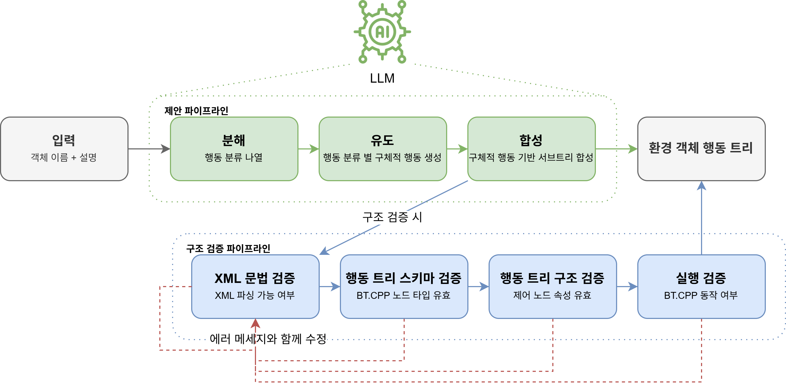

**그림 1. 제안 파이프라인**

## 3. 연구 방법

행동의 집합 생성에서 핵심 과제는 행동의 포괄성이다. LLM에게 모든 행동을 포함하는 행동 트리를 생성하도록 지시하면 전형적 행동에 편향되어 특수 상황을 누락하는 경우[\[10\]](#ref-10)가 있다. 본 연구는 이를 해결하기 위해, 생성 과정을 세 단계로 분리하여 탐색 범위를 구조적으로 확장하는 접근을 취한다.

### 3.1. 행동 분류 분해

첫 번째 단계에서는 해당 객체의 행동을 분류로 나열하도록 지시한다. 이때 정상 동작, 고장 상태, 안전 기능, 경계 케이스 등 모든 영역을 포괄하도록 프롬프트에 명시한다. 행동 트리를 바로 생성하면 전형적 행동에 편향되나, 분류 체계를 먼저 세우면 비전형적 영역도 명시적 항목으로 확보된다.

### 3.2. 구체적 행동 유도

두 번째 단계에서는 생성된 분류 목록을 입력으로 제공하고, 각 분류에 해당하는 구체적 행동을 나열하도록 지시한다. 전 단계가 행동 공간의 가로축(어떤 종류의 행동이 있는가)을 정의한다면, 2단계는 세로축(각 종류의 구체적 행동)을 채운다.

### 3.3. 행동 트리 합성

세 번째 단계에서는 행동 목록을 입력으로, 각 행동 분류를 루트 Fallback 아래 독립된 서브트리로 구성하는 BehaviorTree.CPP(BT.CPP)[\[11\]](#ref-11) XML 형식의 행동 트리를 생성하도록 지시한다. 해당 양식은 로보틱스 분야에서 표준으로 활용되는 라이브러리이다. 선택적으로 대상 도메인과 무관한 행동 트리 예시를 첨부하여, 행동의 누출과 편향을 차단하되 XML 양식 학습을 돕는다. 프롬프트 전문은 [\[12\]](#ref-12)에 공개하였다.

### 3.4. 구조 수정

생성된 행동 트리는 XML 문법, BT 스키마, 트리 구조, BT.CPP 런타임의 4단계의 검증 파이프라인에 통과시킨다. 주요 오류는 Sequence/Fallback 노드의 속성 위반 등 스키마 오류이며, 오류 메시지만을 피드백하여 최대 3회 재생성한다. 이때 수정 범위를 명시적으로 구조 오류에 한정한다. 행동 포괄률에 대한 신호를 일절 제공하지 않아 구조 수정이 행동 다양성에도 영향을 주는지 검증할 수 있다.

## 4. 실험 결과

### 4.1. 실험 설계

**표 2. 실험 평가 지표**

| 지표 | 측정 내용 | 방법 |
|---|---|---|
| 구조 유효성 | BT.CPP 실행 통과율 | 4단계 검증 파이프라인 |
| 행동 포괄률 | 기대 행동 대비 매칭율 | 결정론적 키워드 매칭 |

실험 대상은 엘리베이터, 드론, 스마트 팩토리 3개 도메인의 11개 환경 객체이다. 각 도메인은 3~4개의 환경 객체로 구성되며, 객체당 6~8개의 기대 행동이 정의되어 있다. 기대 행동의 경우 EN 81-20, PX4 유저 가이드, ISO 3691-4 등 공개 표준에서 도출하였으며, 생성 LLM에는 노출하지 않는다. 평가 지표는 표 2와 같다. 행동 포괄률은 각 기대 행동에 대해 필수 키워드 1개 이상과 모든 선택 그룹에서 1개 이상이 일치할 경우 해당 행동으로 판정한다.

전략의 효과가 특정 모델에만 의존하는 지 확인하기 위해, 폐쇄형 모델인 GPT-4와 개방형 모델인 Llama-3 70B에서 각각 실험한다. 두 모델 모두 Temperature 0.7로, 4개 전략에 대해 11개 객체 모두 10회 반복으로 모델 당 440회, 합산 880회 생성한다. 4개 전략은 제로샷, 퓨샷(도메인 무관 BT.CPP XML 예시 2개), 제안 파이프라인, 제안 파이프라인 + 퓨샷이다.

### 4.2. 행동 포괄률

제안 방법은 두 모델 모두 제로샷 대비 행동 포괄률을 대폭 향상시켰다. GPT-4에서 2.5배(p < 0.001, d = 0.99), Llama-3 70B에서 2.3배(p < 0.001, d = 1.21)로 모델에 관계 없이 통계적으로 유의미한 향상이 관찰되었다. 퓨샷도 제로샷 대비 향상을 보였으나, 제안 방법과의 차이가 크다. 이는 양식 예시 제공만으로는 행동 다양성 향상에 한계가 있음을 시사한다.

Llama-3가 GPT-4보다 모든 전략에서 9~18%p 높은 포괄률을 보였다. 이는 행동을 떠올리는 능력과 양식을 준수하는 능력이 서로 다른 차원임을 시사한다.

제안 방법에 퓨샷을 추가한 전략의 경우 GPT-4는 51.4%, Llama-3는 69.4%로 두 모델 모두에서 가장 높은 포괄률을 기록했으며, 이 경향은 세 도메인에서 일관되게 나타났다(그림 2). 10회 반복 간 표준오차는 제안+퓨샷 기준 GPT-4 ±7.0%p, Llama-3 ±4.8%p로, 전략 간 차이(20%p 이상)에 비해 충분히 작아 결과의 안정성을 확인할 수 있다.

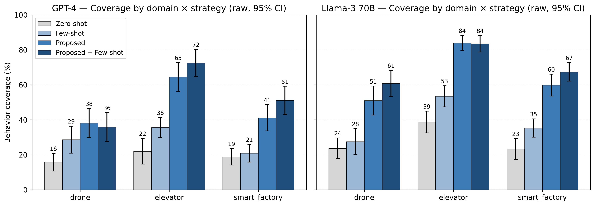

**그림 2. 도메인 별 커버 범위 결과 (좌: GPT-4, 우: Llama-3 70B)**

### 4.3. 구조 유효성과 행동 다양성의 독립성

두 모델 간 가장 두드러진 차이는 구조 유효성에서 나타났다. GPT-4는 퓨샷 예시 없이도 63.6~73.6%의 구조 유효율을 보인 반면, Llama-3는 1.8~3.6%에 불과하였다. 이는 GPT-4가 BT.CPP XML 양식을 생성할 수 있는 능력을 갖춘 반면, Llama-3는 갖추지 못하였음을 의미한다. 그러나 퓨샷 예시가 제공되면 Llama-3의 유효율은 98.2~100%로 급등하여 양식 학습의 소수의 예시만으로 즉시 이루어짐을 확인했다.

구조 수정 전 주요 오류는 BT.CPP v4 스키마 위반이 대부분이었다. 구조 수정은 유효율을 크게 향상시키며, 행동 포괄률에는 제한된 영향을 주었다. GPT-4 유효율은 최대 +35.5%p 향상된 반면 포괄률 변동은 모든 전략에서 ±1.0%p 이내였다. Llama-3에서도 유효율이 최대 +94.5%p 향상되었으나 포괄률 변동은 −4.4%p 이내였다. 이는 구조 수정이 행동 내용을 변경하지 않고 구조 오류만을 회복함을 의미하며, 구조적 정확성과 행동 다양성이 서로 독립적인 능력임을 보여준다. GPT-4는 구조적으로 정확하나 전형적 행동에 편중되고, Llama-3는 비전형적 행동까지 다양하게 생성하나 양식 준수가 낮아 퓨샷이 필수인 점이 이를 뒷받침한다.

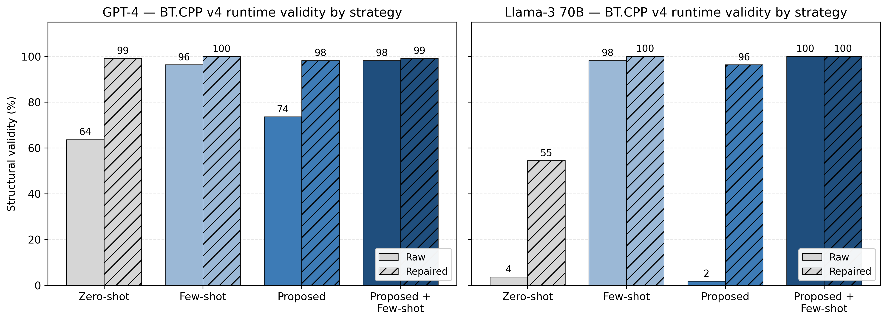

**그림 3. 전략 별 구조 유효성 결과 (좌: GPT-4, 우: Llama-3 70B)**

**표 3. 전략별 주요 실험 결과 (구조 수정 무 / 유, %)**

| 전략 | GPT-4 유효율 | GPT-4 포괄률 | Llama-3 유효율 | Llama-3 포괄률 |
|---|---:|---:|---:|---:|
| 제로샷 | 63.6 / 99.1 | 18.6 | 3.6 / 54.5 | 27.7 |
| 퓨샷 | 96.4 / 100 | 27.7 | 98.2 / 100 | 37.4 |
| 제안 방법 | 73.6 / 98.2 | 46.4 | 1.8 / 96.4 | 63.2 |
| **제안 + 퓨샷** | **98.2 / 99.1** | **51.4** | **100 / 100** | **69.4** |

### 4.4. 논의

위 결과에서 세 가지 시사점을 도출한다. 첫째, 행동 다양성과 구조 유효성은 독립적 능력이며, 제안 파이프라인과 퓨샷 및 구조 수정이 각각을 독립적으로 향상시킨다. 둘째, 제안 방법의 3단계 분해는 Chain-of-Thought[\[13\]](#ref-13)나, Prompt Chaining[\[14\]](#ref-14)이 단일 호출에서 추론 과정을 유도하거나 범용적 단계 연쇄를 구성하는 것과 달리, 분류 수립, 행동 열거, XML 생성의 역할별 호출 분리를 통해 행동 공간 탐색을 구조적으로 확장한다. ReAct[\[15\]](#ref-15)는 외부 도구 호출을 전제하므로 본 연구와는 적용 조건이 다르다. 셋째, 생성된 행동 트리의 구조 유효성은 실행 가능성의 최소 요건이며, 의미적 정확성이나 테스트 요구사항 충족도의 평가는 실제 SIL 투입 후 가능하다.

## 5. 결 론

본 논문은 환경 객체 중심의 SIL 테스트와, 이를 실현하기 위해 행동 트리를 LLM으로 자동 생성하는 분해–유도–합성 파이프라인을 제안한다. 제안 방법은 기대 행동 노출 없이 모든 도메인에서 제로샷 대비 GPT-4 2.5배, Llama-3 2.3배의 포괄률이 향상했으며, 이 효과는 두 모델과 세 도메인에 걸쳐 일관되게 나타났다. 또한 구조 수정이 포괄률에 제한적 영향만 주어 구조적 정확성과 행동 다양성이 독립적임을 확인하였다.

본 연구의 한계는 다음과 같다. 첫째, 테스트 요구사항 충족도는 실제 SIL 투입 후 측정 가능한 지표로, 본 연구의 평가 범위 밖이다. 둘째, 기대 행동이 표준에서 수작업으로 도출되어 완전성이 보장되지 않으나, 동일 기준을 모든 전략에 적용하여 상대 비교의 공정성은 확보하였다. 셋째, 실험이 두 모델에 한정되어 일반화에 추가 검증이 필요하다. 향후 연구로는 표준 문서를 프롬프트에 활용한 포괄률 향상과, 생성된 행동 트리의 실제 SIL 투입을 통한 결함 검출 유효성 검증을 계획하고 있다. 대표 예시와 비교 분석은 [\[12\]](#ref-12)에 공개하였다.

## 참고 문헌

<a id="ref-1"></a>**[1]** [Synopsys, "What is Software-in-the-Loop Testing?," 2021.](https://www.synopsys.com/blogs/chip-design/what-is-software-in-the-loop-testing.html)

<a id="ref-2"></a>**[2]** [dSPACE, "Automotive SIL Testing," 2024.](https://www.dspace.com/en/pub/home/news/engineers-insights/sil-introduction.cfm)

<a id="ref-3"></a>**[3]** [R. Rato et al., "Software Testing of Embedded Safety Loops," *Elevator World*, 2025.](https://elevatorworld.com/article/software-testing-of-embedded-safety-loops/)

<a id="ref-4"></a>**[4]** [M. Colledanchise and P. Ögren, *Behavior Trees in Robotics and AI*, CRC Press, 2018.](https://doi.org/10.48550/arXiv.1709.00084)

<a id="ref-5"></a>**[5]** [A. Lykov and D. Tsetserukou, "LLM-BRAIn: AI-driven Fast Generation of Robot Behaviour Tree," *IEEE FLLM*, 2024.](https://doi.org/10.1109/FLLM63129.2024.10852491)

<a id="ref-6"></a>**[6]** [R. A. Izzo et al., "BTGenBot: Behavior Tree Generation for Robotic Tasks with Lightweight LLMs," *IROS*, 2024.](https://doi.org/10.1109/IROS58592.2024.10802304)

<a id="ref-7"></a>**[7]** [Z. Chen et al., "OBTEA: Integrating Intent Understanding and Optimal Behavior Planning for BT Generation," *IJCAI*, 2024.](https://doi.org/10.24963/ijcai.2024/755)

<a id="ref-8"></a>**[8]** [Y. Jiang et al., "Code-BT: A Code-Driven Approach to Behavior Tree Generation," *IJCAI*, 2025.](https://doi.org/10.24963/ijcai.2025/980)

<a id="ref-9"></a>**[9]** [Y. Li et al., "LLM and BT Based Test Scenario Generation for AVs," *IEEE TrustCom*, 2024.](https://doi.org/10.1109/TrustCom63139.2024.00243)

<a id="ref-10"></a>**[10]** [V. Shwartz and Y. Choi, "Do Neural Language Models Overcome Reporting Bias?," *COLING*, 2020.](https://doi.org/10.18653/v1/2020.coling-main.605)

<a id="ref-11"></a>**[11]** [D. Faconti, *BehaviorTree.CPP v4*, GitHub, 2024.](https://github.com/BehaviorTree/BehaviorTree.CPP)

<a id="ref-12"></a>**[12]** <https://github.com/99JIK/KCC2026>

<a id="ref-13"></a>**[13]** [J. Wei et al., "Chain-of-Thought Prompting Elicits Reasoning in Large Language Models," *NeurIPS*, 2022.](https://doi.org/10.48550/arXiv.2201.11903)

<a id="ref-14"></a>**[14]** [T. Wu et al., "AI Chains: Transparent and Controllable Human-AI Interaction by Chaining LLM Prompts," *CHI*, 2022.](https://doi.org/10.1145/3491102.3517582)

<a id="ref-15"></a>**[15]** [S. Yao et al., "ReAct: Synergizing Reasoning and Acting in Language Models," *ICLR*, 2023.](https://doi.org/10.48550/arXiv.2210.03629)

---

## 부록 A. 저장소 구성

저장소에 들어있는 파일을 위에서 아래로 살펴본다. 경로는 모두 루트 기준 상대 경로다.

```
.
├── run_experiment.py            진입점 (4 전략 × 11 객체 × 10 반복 = 440 셀)
├── src/                         Python 패키지
│   ├── generators/              LLM 호출과 4 전략 구현
│   ├── prompts/                 시스템·사용자 프롬프트 템플릿
│   ├── bt_validator/            BT.CPP v4 검증과 행동 포괄률 채점
│   └── utils/                   로깅·통계 헬퍼
├── cpp/                         BT.CPP v4 로더 (C++ 단일 소스)
├── data/few_shot_examples/      도메인 무관 BT 예시 (퓨샷 전략에 주입)
├── experiments/
│   ├── configs/                 모델·도메인 정의
│   ├── logs/                    880회 raw + repaired JSONL 로그
│   ├── results/{gpt4,llama}/    정렬된 분석 결과 CSV (모델당 10개)
│   ├── figures/                 본문 그림 1~3 · 부록 그림 C1~C9
│   └── human_eval/{gpt4,llama}/ 사람 평가용 표집 BT와 빈 템플릿 (부록 E)
├── scripts/                     분석·표 산출·그림 재생성·로더 빌드
└── tests/                       단위 테스트
```

### A.1 소스 코드

| 파일 | 역할 |
|---|---|
| [`run_experiment.py`](run_experiment.py) | 실험 실행 진입점 |
| [`src/generators/bt_generator.py`](src/generators/bt_generator.py) | 4 전략 구현 + 구조 수리 패스 |
| [`src/generators/llm_client.py`](src/generators/llm_client.py) | OpenAI 및 OpenAI-호환 (Together AI) 통합 LLM 클라이언트 |
| [`src/prompts/templates.py`](src/prompts/templates.py) | 시스템 프롬프트와 전략별 사용자 프롬프트 7종 |
| [`src/bt_validator/validator.py`](src/bt_validator/validator.py) | BT.CPP v4 런타임 검증 4단계 파이프라인 |
| [`src/bt_validator/coverage.py`](src/bt_validator/coverage.py) | 필수/선택 키워드 매칭 기반 행동 포괄률 채점기 |
| [`src/utils/logging.py`](src/utils/logging.py) | 실험 결과 JSONL 로깅 헬퍼 |
| [`src/utils/stats.py`](src/utils/stats.py) | 혼합효과 회귀·짝지은 검정·부트스트랩 유틸리티 (분석 스크립트 공용) |
| [`cpp/btcpp_loader.cpp`](cpp/btcpp_loader.cpp) | BehaviorTree.CPP 로더 (C++ 바이너리, `scripts/build_loader.sh`로 빌드) |

### A.2 실험 구성 (`experiments/configs/`)

| 파일 | 내용 |
|---|---|
| [`experiments/configs/default.yaml`](experiments/configs/default.yaml) | GPT-4 실험 (4 전략, 10 반복) |
| [`experiments/configs/llama.yaml`](experiments/configs/llama.yaml) | Llama-3 70B 실험 (Together AI) |
| [`experiments/configs/_domains.yaml`](experiments/configs/_domains.yaml) | 3 도메인 × 11 객체와 객체별 기대 행동 6~8개의 정의 |

### A.3 퓨샷 예시 데이터 (`data/`)

| 파일 | 내용 |
|---|---|
| [`data/few_shot_examples/npc_guard.xml`](data/few_shot_examples/npc_guard.xml) | 게임 NPC 경비 행동 트리 (SIL과 무관) |
| [`data/few_shot_examples/smart_thermostat.xml`](data/few_shot_examples/smart_thermostat.xml) | 스마트 온도조절기 행동 트리 (SIL과 무관) |

### A.4 실험 로그 (논문 수치의 원본)

| 파일 | 셀 수 | 비고 |
|---|---:|---|
| [`experiments/logs/gpt4_run.jsonl`](experiments/logs/gpt4_run.jsonl) | 440 | 4 전략 × 11 객체 × 10 반복, raw + repaired 모두 포함 (880 lines) |
| [`experiments/logs/llama_run.jsonl`](experiments/logs/llama_run.jsonl) | 440 | 동일 구성 (Llama-3 70B) |

### A.5 분석 결과 표 (`experiments/results/`)

위 JSONL을 `scripts/analyze.py --csv`로 돌려서 뽑은 CSV들이다. 본문 표·그림 수치가 여기서 나왔고, 모델 폴더마다 10개씩 같은 구성으로 들어있다.

| 파일 | 내용 |
|---|---|
| [`experiments/results/gpt4/main_table.csv`](experiments/results/gpt4/main_table.csv) · [`llama/`](experiments/results/llama/main_table.csv) | 전략 × condition별 유효율·포괄률 평균과 95% CI, 부트스트랩 CI, 토큰·노드 평균 (본문 표 3) |
| [`gpt4/by_domain_raw.csv`](experiments/results/gpt4/by_domain_raw.csv) · [`by_domain_repaired.csv`](experiments/results/gpt4/by_domain_repaired.csv) | 도메인 × 전략별 포괄률 (본문 그림 2) |
| [`gpt4/by_object_raw.csv`](experiments/results/gpt4/by_object_raw.csv) | 11 객체 × 전략별 포괄률 (부록 그림 C1) |
| [`gpt4/category_coverage.csv`](experiments/results/gpt4/category_coverage.csv) | 도메인별 안전·기능 카테고리(15~18종) × 전략 포괄률 (부록 그림 C6) |
| [`gpt4/per_behavior.csv`](experiments/results/gpt4/per_behavior.csv) | 개별 기대 행동(73종) × 전략 매칭율 — 가장 어려운/쉬운 행동 식별 |
| [`gpt4/validity_gain.csv`](experiments/results/gpt4/validity_gain.csv) | raw → repaired 유효율·포괄률 변화량 (부록 그림 C9) |
| [`gpt4/repair_stats.csv`](experiments/results/gpt4/repair_stats.csv) | 전략별 평균 수리 호출 횟수와 최종 잔존 오류 (부록 그림 C2) |
| [`gpt4/pairwise_tests.csv`](experiments/results/gpt4/pairwise_tests.csv) | 6쌍의 짝지은 Wilcoxon 검정 결과 (W, p, Cohen's d, Holm 보정) |
| [`gpt4/winrate_per_object.csv`](experiments/results/gpt4/winrate_per_object.csv) | 11 객체 각각에서 어느 전략이 최고 포괄률을 기록했는지의 승률 |

### A.6 분석 스크립트 (`scripts/`)

| 파일 | 역할 |
|---|---|
| [`scripts/analyze.py`](scripts/analyze.py) | JSONL 로그로부터 표 3 수치 (수리 전/후 유효율·포괄률), 짝지은 검정, 부트스트랩 산출 |
| [`scripts/figures.py`](scripts/figures.py) | 그림 2와 3 재생성 |
| [`scripts/figures_appendix.py`](scripts/figures_appendix.py) | 부록의 그림 C1~C9 재생성 |
| [`scripts/sample_for_human_eval.py`](scripts/sample_for_human_eval.py) | 사람 평가용 BT 층화 표집과 빈 템플릿 생성 (부록 E.1) |
| [`scripts/compare_human_eval.py`](scripts/compare_human_eval.py) | 채워진 템플릿으로 κ·F1·상관 산출 (부록 E.3) |
| [`scripts/build_loader.sh`](scripts/build_loader.sh) | [`cpp/btcpp_loader.cpp`](cpp/btcpp_loader.cpp) 빌드 → `src/bt_validator/btcpp_loader` |

### A.7 단위 테스트 (`tests/`)

| 파일 | 대상 |
|---|---|
| [`tests/test_bt_generator.py`](tests/test_bt_generator.py) | 4 전략 분기, 3 단계 파이프라인 흐름, 구조 수리 동작 |
| [`tests/test_validator.py`](tests/test_validator.py) | BT.CPP 로더 호출과 4단계 검증 |
| [`tests/test_coverage.py`](tests/test_coverage.py) | 필수/선택 키워드 매칭 로직 |

---

## 부록 B. 프롬프트

[`src/prompts/templates.py`](src/prompts/templates.py)에 들어있는 프롬프트의 전문을 그대로 옮겨 둔다. `{object_name}` 같은 중괄호 토큰은 실행 시 객체 메타데이터로 채워진다.

#### B.1 시스템 프롬프트 ([`templates.py:11`](src/prompts/templates.py#L11))

```
You are an expert in simulation-based testing and behavior design for 
Software-In-The-Loop (SIL) environments.

You generate Behavior Trees (BTs) for ENVIRONMENT OBJECTS in SIL simulation 
— NOT for the System Under Test, but for the surrounding agents and entities 
that interact with the SUT.

A behavior repertoire BT is NOT a script for one test scenario. It contains 
ALL possible behaviors the object could exhibit in reality, organized as 
distinct subtrees. Simulation conditions activate the appropriate subtrees 
at runtime.

BehaviorTree.CPP v4 XML format:
- Root wrapper: <root BTCPP_format="4"> with <BehaviorTree ID="...">
- Control nodes: <Sequence>, <Fallback>, <Parallel>
- Decorator nodes: <Repeat>, <Inverter>, <ForceSuccess>, <ForceFailure>, <RetryUntilSuccessful>
- Leaf nodes: <Action ID="..."/>, <Condition ID="..."/>

Output ONLY valid BehaviorTree.CPP v4 XML wrapped in ```xml ... ``` blocks.
```

#### B.2 제로샷 전략 프롬프트 ([`templates.py:32`](src/prompts/templates.py#L32))

```
Generate a complete behavior repertoire as a Behavior Tree for the following 
SIL environment object.

Domain: {domain}
SUT: {sut_description}
Environment Object: {object_name} — {object_description}

Include ALL possible behaviors this object could exhibit in a realistic 
simulation, organized as distinct subtrees. Do NOT generate a script for a 
single scenario.
```

#### B.3 퓨샷 전략 프롬프트 ([`templates.py:44`](src/prompts/templates.py#L44))

```
Generate a complete behavior repertoire as a Behavior Tree for a SIL 
environment object.

Here are examples of well-structured behavior repertoire BTs from UNRELATED 
domains (a video game NPC and a smart thermostat). Use them only as a guide 
to the XML format and to the general "repertoire" pattern (multiple distinct 
behavior subtrees under one root). The actual behaviors of your target object 
will be entirely different from these examples.

{examples}

---

Now generate a behavior repertoire for:

Domain: {domain}
SUT: {sut_description}
Environment Object: {object_name} — {object_description}

Include ALL possible behaviors this object could exhibit in a realistic 
simulation, organized as distinct subtrees.
```

#### B.4 제안 — 1단계: 행동 분류 분해 ([`templates.py:67`](src/prompts/templates.py#L67))

```
You are analyzing a SIL environment object to enumerate the BEHAVIOR 
DIMENSIONS it could exhibit in a realistic simulation.

A behavior dimension is a high-level category of related behaviors — e.g.,
"emergency response", "normal operation", "fault handling", "user interaction".

Domain: {domain}
SUT (which the object interacts with): {sut_description}
Environment Object: {object_name} — {object_description}

List {n_lo} to {n_hi} distinct behavior dimensions for this object. Cover the 
full range: normal operation, fault/error handling, safety responses, 
environmental disturbances, interactions with other agents, and edge cases. 
Be exhaustive — prefer over-listing to under-listing.

Output ONLY a numbered list, one dimension per line, with a short name and 
a one-sentence description. No XML, no preamble.
```

#### B.5 제안 — 2단계: 구체적 행동 유도 ([`templates.py:86`](src/prompts/templates.py#L86))

```
You previously identified the following behavior dimensions for the SIL 
environment object "{object_name}":

{dimensions}

For EACH dimension above, list {b_lo} to {b_hi} concrete, specific behaviors 
the object could exhibit. A concrete behavior is something that could be 
implemented as a Behavior Tree subtree — it has a clear trigger condition 
and a clear sequence of actions.

Be exhaustive within each dimension. Think about variations, edge cases, and 
realistic situations the simulation might need to reproduce.

Output as a structured list, grouped by dimension:

Dimension 1: <name>
  - <concrete behavior>
  - <concrete behavior>
  ...
Dimension 2: <name>
  - <concrete behavior>
  ...

No XML, no preamble. Just the structured list.
```

#### B.6 제안 — 3단계: 행동 트리 합성 ([`templates.py:112`](src/prompts/templates.py#L112))

```
You have enumerated the following behaviors for the SIL environment object 
"{object_name}" (a {object_description}) in the {domain} domain:

{enumeration}

Now convert this enumeration into a single behavior repertoire Behavior Tree 
in BehaviorTree.CPP v4 XML format. Each dimension from the enumeration should 
become a distinct subtree under the root. Each concrete behavior within a 
dimension should be implementable as a sequence/fallback within that subtree.

Use a Fallback at the root with priority order: emergency/safety responses 
first, then fault handling, then normal operation. Or use Parallel if the 
behaviors run as independent subsystems.

Output ONLY the BehaviorTree.CPP v4 XML wrapped in ```xml ... ``` blocks. 
Make sure every behavior from the enumeration above is represented as a 
subtree or sequence in the resulting BT.
```

#### B.7 제안 + 퓨샷 — 3단계 합성 (예시 포함) ([`templates.py:131`](src/prompts/templates.py#L131))

```
You have enumerated the following behaviors for the SIL environment object 
"{object_name}" (a {object_description}) in the {domain} domain:

{enumeration}

Here are examples of well-structured behavior repertoire BTs from UNRELATED 
domains. Use them only as a guide to the XML format and Action ID naming 
convention. The actual behaviors of your target object are entirely different 
from these examples — do NOT copy their structure or behaviors, only their 
style of fine-grained, specific node naming.

{examples}

---

Now convert your enumeration above into a single behavior repertoire Behavior 
Tree in BehaviorTree.CPP v4 XML format. Each dimension from the enumeration 
should become a distinct subtree under the root. Each concrete behavior 
within a dimension should be implementable as a sequence/fallback within 
that subtree.

Use a Fallback at the root with priority order: emergency/safety responses 
first, then fault handling, then normal operation. Or use Parallel if the 
behaviors run as independent subsystems.

Output ONLY the BehaviorTree.CPP v4 XML wrapped in ```xml ... ``` blocks. 
Make sure every behavior from your enumeration above is represented as a 
subtree or sequence in the resulting BT.
```

#### B.8 구조 수리 프롬프트 ([`templates.py:161`](src/prompts/templates.py#L161))

````
Your previous Behavior Tree has structural errors that prevent it from 
loading or executing in the BehaviorTree.CPP v4 runtime.

ERRORS:
{feedback}

Previous BT:
```xml
{previous_bt}
```

Please produce a corrected version that resolves these structural errors. 
PRESERVE the original tree's intent and structure as much as possible — only 
fix the specific errors above. Do NOT remove or simplify any subtrees.

Output ONLY the corrected BehaviorTree.CPP v4 XML wrapped in ```xml ... ``` blocks.
````


---

## 부록 C. 추가 그림

본문 그림 1·2·3 말고도 880회 결과에서 뽑을 만한 시각화가 더 있어서 여기 모아 두었다. C.1부터 C.3까지는 객체·수리·비용 쪽 보조 자료이고, C.4부터는 분포와 진단이다 (어떤 카테고리에서 막히는지, 어떤 구문 오류가 잦은지, 트리가 얼마나 두꺼워지는지 등).

### C.1 객체별 행동 포괄률

11개 객체 각각의 포괄률을 전략별로 나란히 본 것이다. `airspace_obstacle`, `human_worker`처럼 행동 어휘가 모호한 객체는 어느 전략에서도 30% 이하에 머무는 반면, `building_system`, `conveyor_system`은 제안+퓨샷에서 80%를 넘는다. 표 3의 평균이 어느 객체에서 어떻게 만들어지는지가 한눈에 잡힌다.

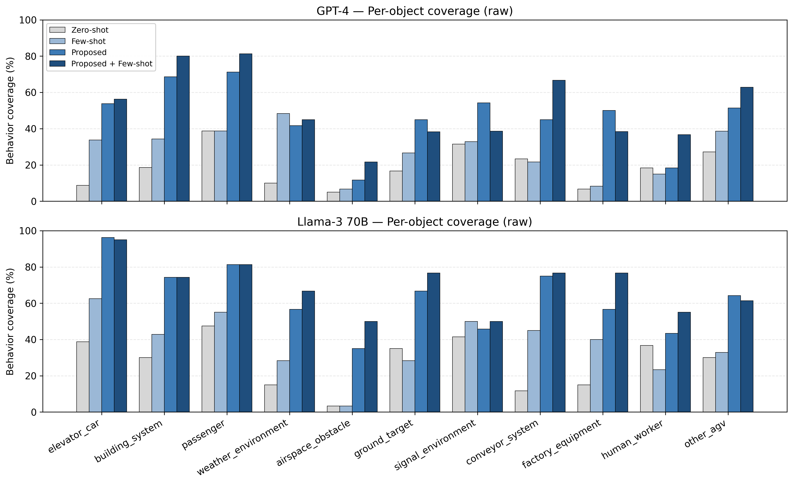

**그림 C1. 객체별 행동 포괄률 (위: GPT-4, 아래: Llama-3 70B)**

### C.2 수리 반복 횟수 분포

각 셀이 BT.CPP를 통과하기까지 몇 번 수리를 거쳤는지 0에서 3까지 묶어 본 분포다. 0이면 첫 시도부터 멀쩡했다는 뜻. GPT-4는 0에 몰려 있고, Llama-3 제로샷·제안에서는 2~3회까지 가는 셀이 꽤 있다. 상한 3회 안에서 거의 다 흡수된다.

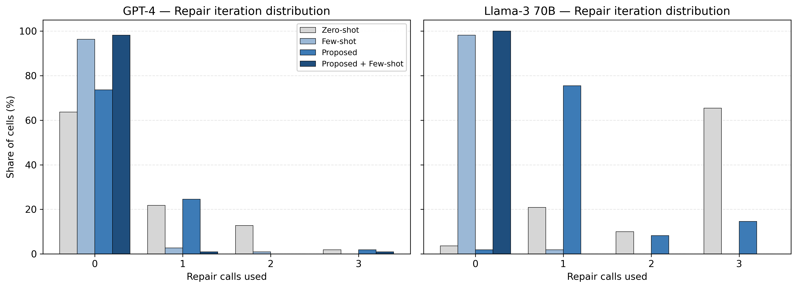

**그림 C2. 수리 반복 횟수 분포 (좌: GPT-4, 우: Llama-3 70B)**

### C.3 제안 파이프라인 토큰 비용

분해·유도·합성 세 단계의 평균 토큰 비용이다. XML을 직접 짜내는 합성이 가장 크고, 나머지 둘이 그 절반 정도 차지한다. 단일 호출보다 총 비용은 2~3배가 들지만, 포괄률은 GPT-4에서 +28pp, Llama-3에서 +35pp 오른다.

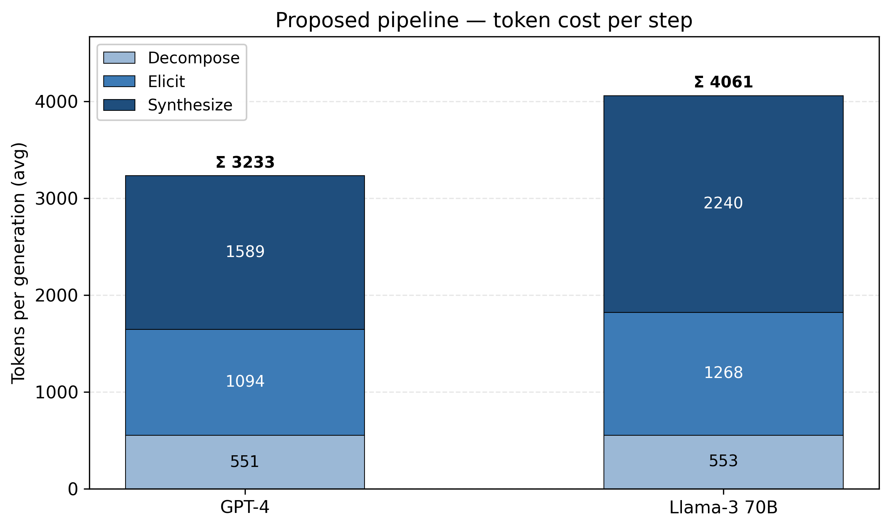

**그림 C3. 제안 파이프라인의 단계별 토큰 비용 (모델별 평균)**

### C.4 포괄률 분포

raw 110셀의 포괄률 boxplot이다. 제로샷·퓨샷은 0에서 80% 사이로 넓게 흩어지고 1사분위가 거의 바닥에 붙어 있다. 반면 제안 계열은 중앙값뿐 아니라 1사분위까지 같이 위로 올라간다. 평균이 오른 게 잘 나온 셀 몇 개 덕이 아니라 분포 자체가 위로 옮겨간 결과라는 얘기다.

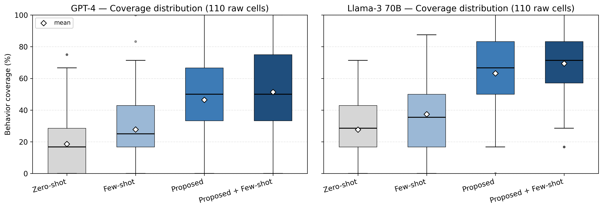

**그림 C4. 전략별 행동 포괄률 분포 (좌: GPT-4, 우: Llama-3 70B)**

### C.5 포괄률 × 구문 유효성

가로가 raw 유효성, 세로가 포괄률인 산점도다. 점마다 95% CI 오차막대가 붙어 있다. 둘 다 좋으면 우상단으로 간다. GPT-4 제안+퓨샷은 거기에 자리잡는다. 반대로 Llama-3 제안·제안+퓨샷은 포괄률은 높아도 raw 유효성이 한 자릿수에 그치기 때문에, 수리 패스를 거치지 않으면 우상단까지 못 간다.

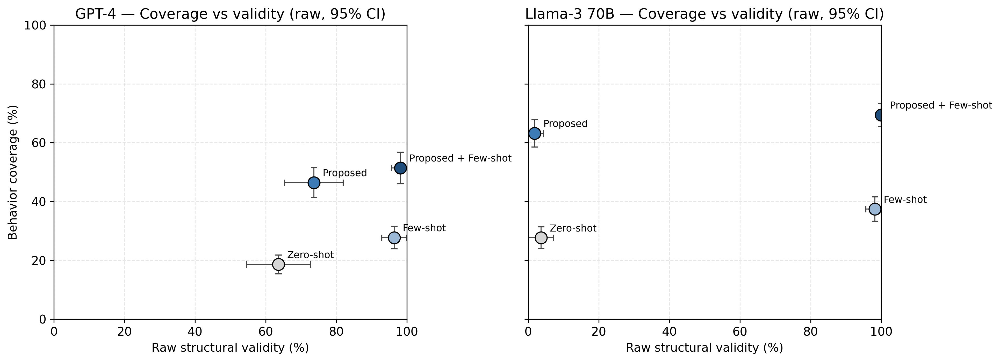

**그림 C5. 행동 포괄률과 구문 유효성의 트레이드오프 (raw, 95% CI)**

### C.6 카테고리별 행동 포괄률

도메인별 카테고리(엘리베이터 15, 드론 16, 스마트팩토리 18종)와 전략을 가로·세로로 두고 두 모델 평균 포괄률을 히트맵에 올렸다. `door_safety`, `gps_loss`, `safety_zone`처럼 표준 어휘가 두꺼운 곳은 어느 전략에서도 무난하게 잡힌다. 그런데 `accessibility`, `dynamic_obstacle`, `manual_task` 쪽은 제안+퓨샷에서도 절반 안팎에 머문다. 키워드 사전을 좀 더 손볼 여지가 남아있는 영역이다.

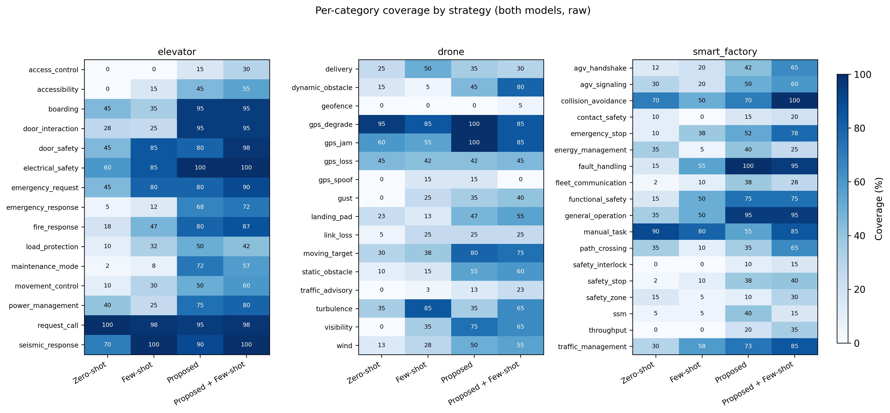

**그림 C6. 카테고리별 행동 포괄률 (양 모델 평균, raw)**

### C.7 Raw 실패 원인 분포

수리 패스 전에 BT.CPP가 받지 못한 원인을 분류해 쌓아 본 막대다. 한 셀에서 여러 원인이 같이 나오면 다 집계했다. GPT-4 제로샷·제안에서는 합성 노드에 `[ID]` 속성을 붙이는 Composite ID misuse가 압도적이다. Llama-3 제로샷은 좀 다른데, `<BehaviorTree>` 아래 자식이 둘 이상인 Multi-rooted tree와 데코레이터 자식 수 오류가 같이 나온다. 본문 4.4절의 수리 단계가 표적으로 삼는 게 이런 유형들이다.

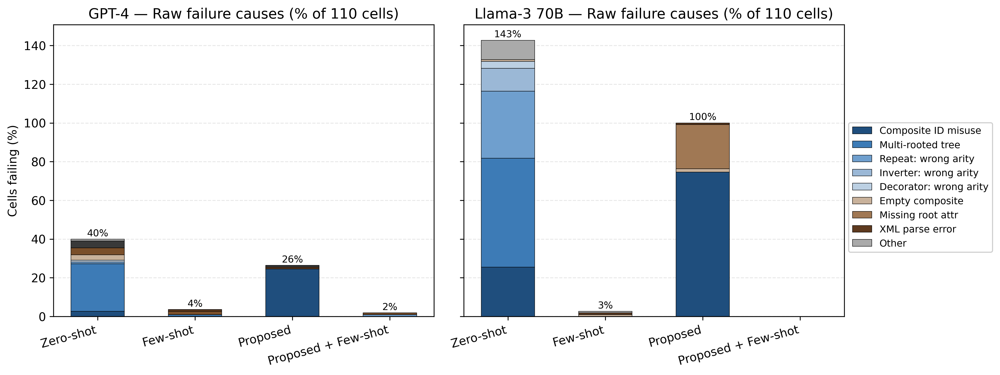

**그림 C7. Raw 단계 BT.CPP 실패 원인 분포 (전략별, 110셀 중 비율)**

### C.8 BT 구조 복잡도

생성된 트리의 총 노드 수와 최대 깊이를 분포로 본 것이다. 제안+퓨샷의 노드 수 중앙값은 GPT-4 약 55, Llama-3 약 120까지 늘어난다. 그런데 최대 깊이는 어느 전략에서도 3~4를 넘지 않는다. 깊어진다기보다 옆으로 퍼지는 모양이다.

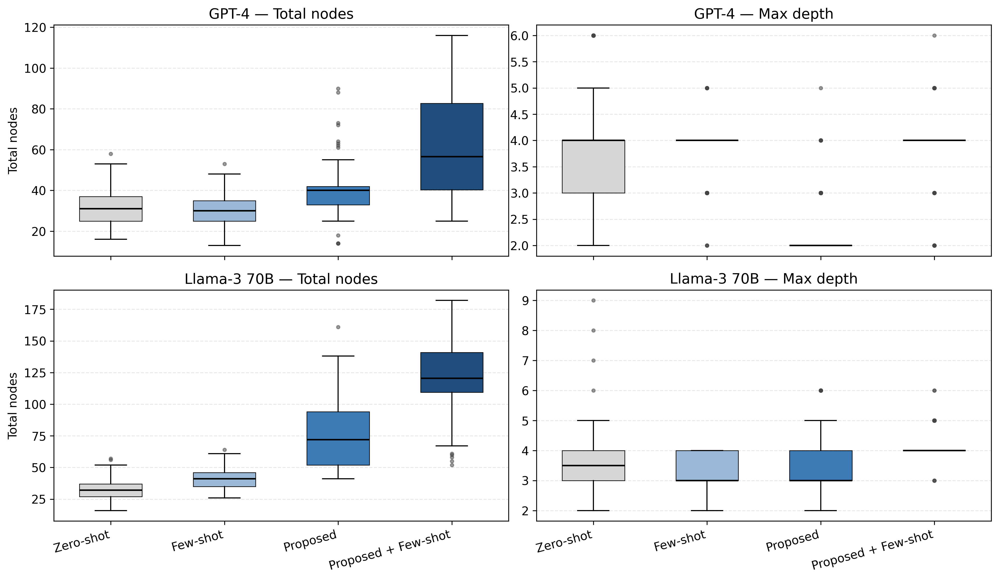

**그림 C8. 생성된 BT의 노드 수와 최대 깊이 (전략별, raw)**

### C.9 수리 패스의 유효성 이득

아래쪽 짙은 막대가 raw 유효성, 위쪽 빗금이 수리로 회복된 폭이다. 막대 꼭대기 굵은 숫자는 수리 후 최종 값이다. Llama-3 제안은 raw 2%에서 +95pp가 붙어 96%까지 올라간다. 표 3 수치가 여기서 만들어진다. Llama-3 제로샷은 raw 4%에서 +51pp만 더해져 55%에서 멈춘다. 처음에 유효한 BT가 너무 적으면 수리만으로 끌어올리는 데에도 한계가 있다는 얘기다.

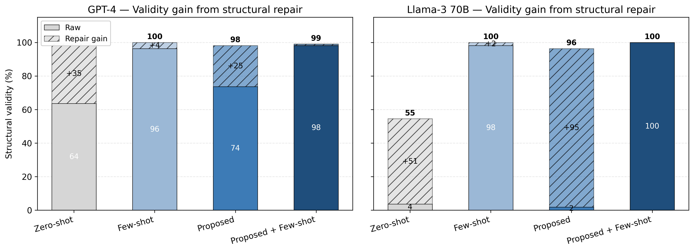

**그림 C9. 구조 수리 패스의 유효성 이득 (raw vs repaired)**

---

## 부록 D. 실험 재현

### D.1 환경 준비

Python 3.10 이상이 있어야 하고, BehaviorTree.CPP 런타임을 빌드하려면 C++ 툴체인도 필요하다. Ubuntu 22.04에서 돌려 확인했다.

```bash
python -m venv .venv
source .venv/bin/activate
pip install -e ".[dev]"

bash scripts/build_loader.sh

cp .env.example .env
# .env 파일에 OPENAI_API_KEY (GPT-4용), TOGETHER_API_KEY (Llama-3용) 입력
```

### D.2 실험 실행

```bash
# GPT-4 (4 전략 × 11 객체 × 10 반복 = 440 셀, 수정 단계 포함)
python run_experiment.py --config experiments/configs/default.yaml

# Llama-3 70B (Together AI 엔드포인트, 동일 구성)
python run_experiment.py --config experiments/configs/llama.yaml
```

실행하면 `experiments/logs/` 안에 타임스탬프가 붙은 JSONL이 쌓인다. (객체, 전략, 반복) 한 셀당 raw와 repaired 두 줄씩 기록된다.

### D.3 분석과 그림 재생성

```bash
# 표 3 수치 (수리 전/후 유효율·포괄률)
python scripts/analyze.py experiments/logs/gpt4_run.jsonl --csv \
    --out experiments/results/gpt4/
python scripts/analyze.py experiments/logs/llama_run.jsonl --csv \
    --out experiments/results/llama/

# 본문 그림 2와 3 재생성
python scripts/figures.py \
    --gpt4 experiments/logs/gpt4_run.jsonl \
    --llama experiments/logs/llama_run.jsonl \
    --out experiments/figures/

# 부록 그림 C1~C9 재생성
python scripts/figures_appendix.py \
    --gpt4 experiments/logs/gpt4_run.jsonl \
    --llama experiments/logs/llama_run.jsonl \
    --out experiments/figures/
```

동봉된 `experiments/logs/`는 논문 수치를 뽑은 그 원본이다. API에 다시 요청하면 같은 셀이라도 샘플링 때문에 비트 수준에서는 살짝 어긋날 수 있다.

---

## 부록 E. 사람 평가 (자동 포괄률 지표 검증용)

자동 키워드 매칭이 사람 판단과 얼마나 맞아 떨어지는지 보려는 절차다. 표집과 빈 템플릿은 저장소에 넣어 두었고, 라벨링은 평가자가 직접 채운다.

### E.1 표집 (`scripts/sample_for_human_eval.py`)

수리 후(repaired) 880 셀을 (전략 × 도메인) 12 버킷으로 나누고, 각 버킷 안에서 자동 포괄률이 낮은·중간·높은 표본을 골고루 뽑는다. 라벨링 부담을 줄이려고 모델당 12 BT, 총 24 BT (160 행쯤)로 잡았다. 두 모델 결과는 한 CSV로 합쳐 두었다. 평가할 때 파일을 왔다 갔다 할 필요가 없다.

```bash
python scripts/sample_for_human_eval.py experiments/logs/gpt4_run.jsonl \
    --n 12 --condition repaired --out experiments/human_eval/gpt4/ --seed 42
python scripts/sample_for_human_eval.py experiments/logs/llama_run.jsonl \
    --n 12 --condition repaired --out experiments/human_eval/llama/ --seed 42
# 두 템플릿을 model 컬럼을 추가해 한 파일로 병합 (한 번만 수행)
```

결과물은 다음과 같다.

| 파일 | 내용 |
|---|---|
| [`experiments/human_eval/human_eval_template.csv`](experiments/human_eval/human_eval_template.csv) | 평가자가 채울 단일 템플릿 (160 행, 두 모델 통합) |
| [`gpt4/sampled_bts/`](experiments/human_eval/gpt4/sampled_bts/) · [`llama/sampled_bts/`](experiments/human_eval/llama/sampled_bts/) | 표집된 BT XML (모델당 12 파일) |
| [`gpt4/sample_index.csv`](experiments/human_eval/gpt4/sample_index.csv) · [`llama/sample_index.csv`](experiments/human_eval/llama/sample_index.csv) | `sample_id` ↔ 원본 (객체, 전략, 반복) 매핑과 자동 포괄률 |

### E.2 라벨링

`human_eval_template.csv`의 컬럼은 다음과 같다.

| 컬럼 | 의미 | 평가자 입력? |
|---|---|---|
| `model` | gpt4 / llama | — |
| `sample_id`, `bt_file`, `domain`, `object`, `strategy` | 어느 BT인지 식별 (`bt_file`은 `human_eval/` 기준 상대 경로) | — |
| `behavior_id`, `behavior_category`, `behavior_text` | 판정 대상 행동 (기대 행동 텍스트) | — |
| `auto_match` | 키워드 매칭의 판정 (0/1) | — |
| `human_match` | 사람 판정 (0/1) | 필수 |
| `confidence` | 자신감 (1~3, 선택; 1=불확실, 2=대체로 확신, 3=명백) | 어려웠던 행만 |
| `notes` | `auto_match`와 `human_match`가 어긋날 때만 한 줄 메모 | 불일치 시만 |

행마다 `experiments/human_eval/<bt_file>`을 열어본다 (예: `experiments/human_eval/gpt4/sampled_bts/000_...xml`). `behavior_text`의 내용이 BT 안에 구체적으로든 추상적으로든 들어가 있다면 1, 없다면 0을 `human_match`에 적는다. 자동과 판정이 갈리는 행에만 `notes`에 짧게 이유를 적어두면, 나중에 키워드 사전을 손볼 때 그대로 쓰기 좋다.

### E.3 비교 (`scripts/compare_human_eval.py`)

라벨링이 끝난 CSV를 입력으로 다음 지표를 산출한다.

- 행동 단위: `auto_match` × `human_match` 혼동 행렬, Cohen's κ, F1
- BT 단위: 자동 포괄률과 사람 포괄률의 Pearson·Spearman 상관 (그룹 키는 `(model, sample_id)`)
- 최다 불일치 행동: 자동이 잘못 잡은(FP) / 놓친(FN) 행동의 순위 — 향후 키워드 사전 개선의 단서

```bash
python scripts/compare_human_eval.py \
    experiments/human_eval/human_eval_template.csv \
    --out experiments/human_eval/comparison.csv
```

### E.4 결과

평가자 1인이 160 행 전체를 라벨한 결과다.

| 지표 | 값 |
|---|---:|
| TP / FP / FN / TN | 30 / 1 / 32 / 97 |
| 정확도 | 79.4% |
| 정밀도 | 0.968 |
| 재현율 | 0.484 |
| F1 | 0.645 |
| Cohen's κ | 0.522 (보통 수준) |
| BT 단위 Pearson r | 0.694 |
| BT 단위 Spearman ρ | 0.680 |

자동 매처는 보수적으로 동작한다. 정밀도 0.97에 재현율 0.48이다. 자동이 양성으로 본 행은 거의 다 사람도 같다고 했는데, 정작 사람이 인정한 구현의 절반 정도를 자동은 놓쳤다. 가장 많이 놓친 곳은 `static_obstacle`·`dynamic_obstacle`이다. 각각 4건 중 4건이 모두 FN으로 잡혔다. 환경 객체 BT가 stationary나 moving 같은 추상으로만 풀어내도 사람은 그 자체로 시나리오 구현으로 받아들인다. 그런데 자동 매처는 static·dynamic이라는 단어가 노드명에 직접 박혀있어야만 인식한다. 유일한 FP는 `DoorObstructionPersisting → AlertMaintenance`다. 키워드는 잡혔는데 실제 동작은 재개방이 아니라 유지보수 호출이었다. 그래도 BT 단위로 보면 자동·사람 포괄률 상관이 r = 0.69로 나오기 때문에, 전략끼리 상대 비교하는 용도라면 자동 지표를 그대로 써도 큰 무리는 없다.

---

## 라이선스 · 인용

- 라이선스: Apache License 2.0 ([`LICENSE`](LICENSE) 참조).
- 데이터·로그: `experiments/logs/`의 JSONL은 논문 표·그림 수치를 뽑은 원본 그대로다.
- 제3자 라이브러리: 본 저장소는 다음 라이브러리에 의존하며 각자의 라이선스 하에서 사용한다.
    - [BehaviorTree.CPP v4](https://github.com/BehaviorTree/BehaviorTree.CPP) — MIT
    - [openai-python](https://github.com/openai/openai-python) — Apache-2.0
    - PyYAML, pytest, ruff — MIT
    - NumPy, SciPy, pandas, statsmodels, matplotlib, python-dotenv — BSD-3-Clause 계열
- 인용:

```bibtex
@inproceedings{kim2026sil-bt-gen,
  title     = {Automatic Generation of Test Environment Behaviors Using LLM for Embedded Software Testing},
  author    = {Kim, Jeongin and Kim, Deokyoep and Lee, Woojin},
  booktitle = {Proceedings of the Korea Computer Congress (KCC)},
  year      = {2026}
}
```
